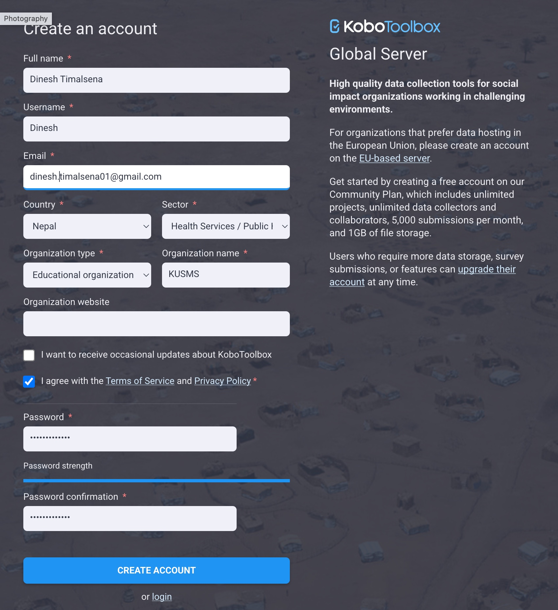

::: {.callout-important}
## Complete this before the in-person session
There is not enough time in class to wait for email confirmations.
:::

1. Go to the KoboToolbox server:
   - **Global server:** <https://kf.kobotoolbox.org>
2. Click **Create an account**.
   {width=70% fig-align="center"}
3. Fill in your name, username, email and password. Use your real name and an email you check regularly.

4. Open the **confirmation email** and click the link to activate your account.
5. Log in and check that you see the **Projects** page.
6. Write down your **username** and the **server** you used. You will need them when setting up the KoboCollect app.

