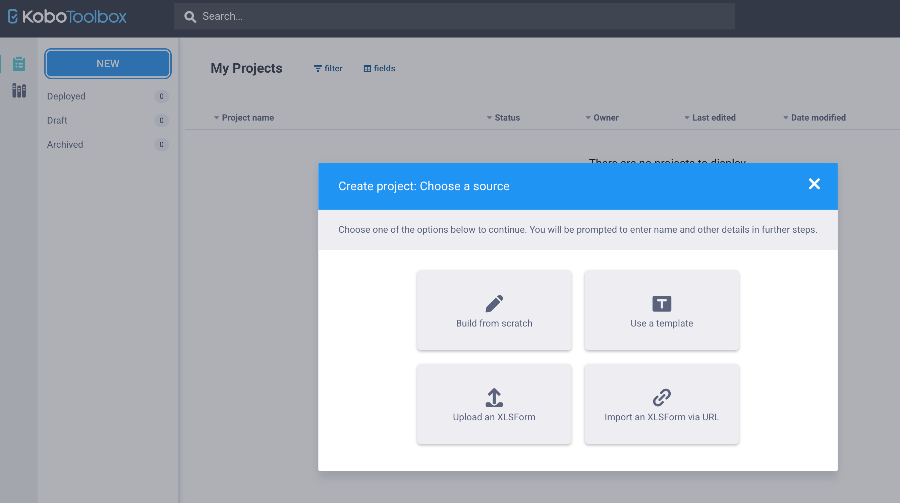

## Upload and deploy your XLSForm

1. Click **NEW** → **Upload an XLSForm**.
2. Choose your `.xlsx` file and click **Upload**.
{width=70% fig-align="center"}
3. Fill in project details (name, description, sector: *Health*, country: *Nepal*) → **Create project**.
4. If you see an error, read it carefully: it usually names the row and the problem (see the table below). Fix the Excel file and upload again via **Replace form**.
5. Click the **eye icon** (Preview) to test the form in your browser. Check skip logic, constraints and the language switch.
6. Click **Deploy**.

## Collect test data

- **Web form:** in the Form tab, open the **Collect data** section and choose the online-offline web form link. Open it on any browser or share it.
- **KoboCollect app (Android):** install *KoboCollect* from the Play Store → configure the server with your server URL and username → **Download form** → **Start new form**. KoboCollect works **offline** in the field; send submissions when you are back online.
- Submit **3 to 5 test records**, including wrong values, to check your constraints.
- In the **Data** tab, view the table and download the data as Excel. Check that each column is correct.

::: {.callout-warning}
Delete all test submissions before you start real data collection.
:::

## Common upload errors

| Error message contains | Likely cause | Fix |
|:--|:--|:--|
| "list name not in choices sheet" | Typo between `select_one xyz` and `list_name` | Make both names identical |
| "unmatched begin statement" | Missing `end_group` | Add `end_group` |
| "duplicate name" | Two rows with the same `name` | Rename one |
| "invalid name" | Space or symbol in `name` | Use letters, numbers and `_` only |
| Error in `relevant` / `constraint` | Missing quotes, wrong `${name}` | Check spelling and quotes |

## Ethics and data protection

- Collect only what your approved protocol needs. Avoid names and phone numbers unless required.
- Share projects with your supervisor through **Settings → Sharing** rather than sharing your password.
- Download and store data on a password-protected device.
