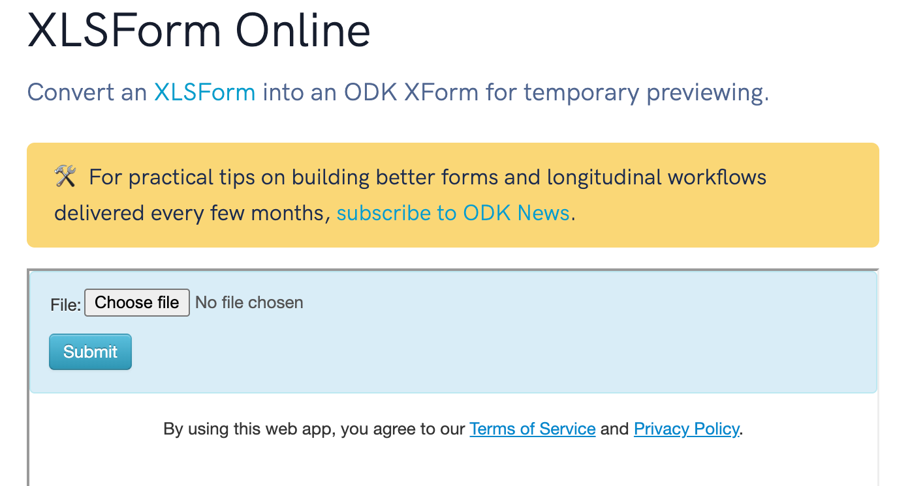
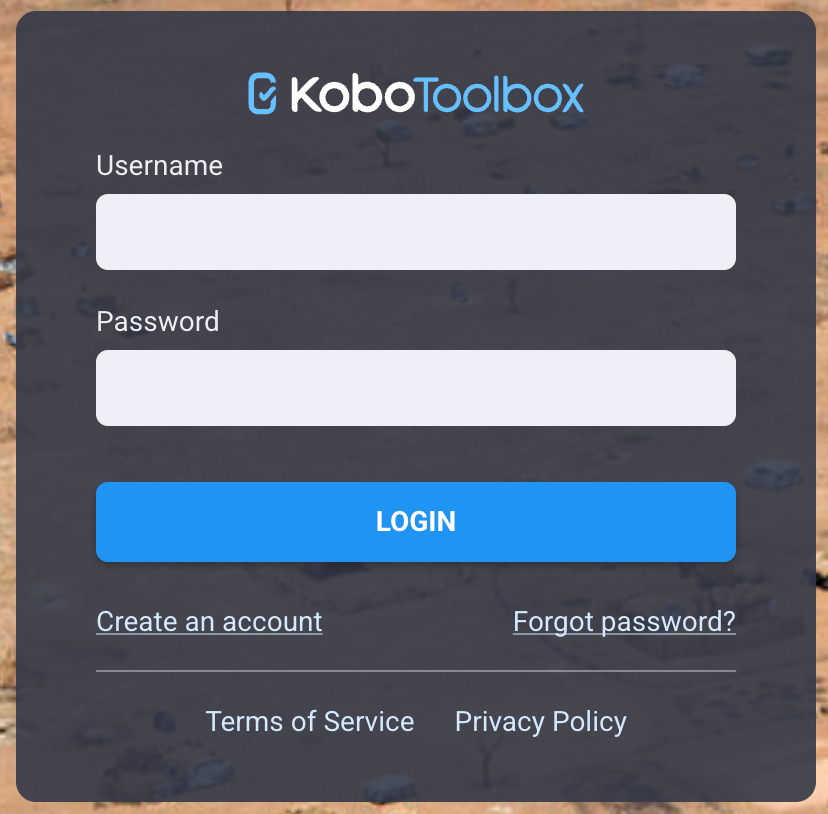
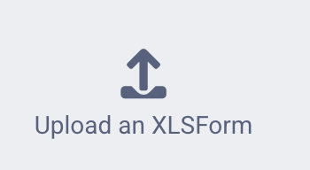
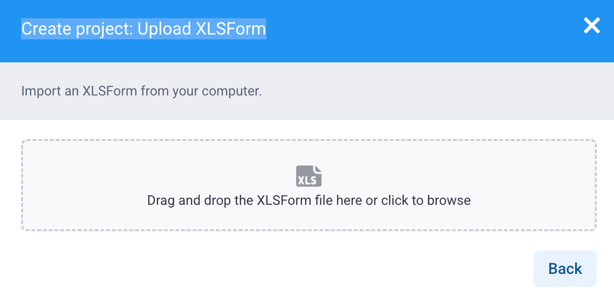
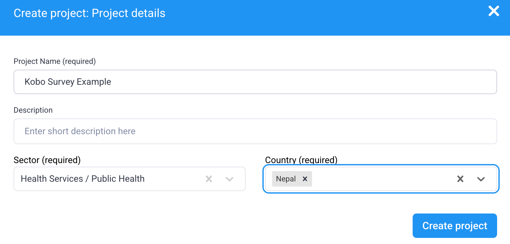
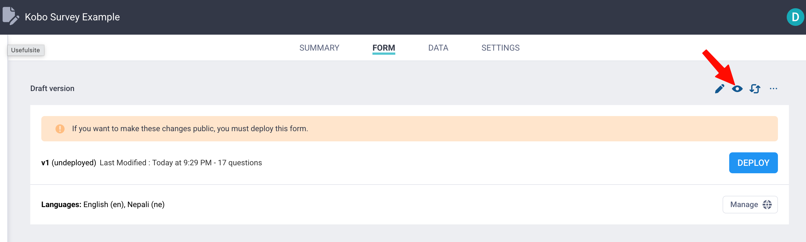
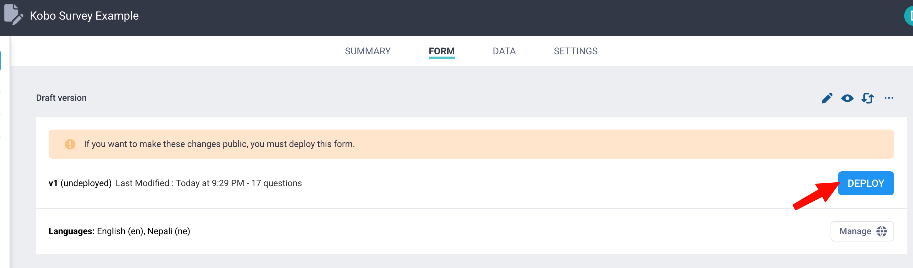
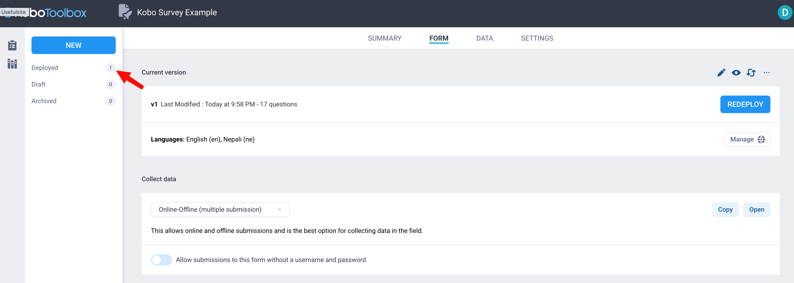
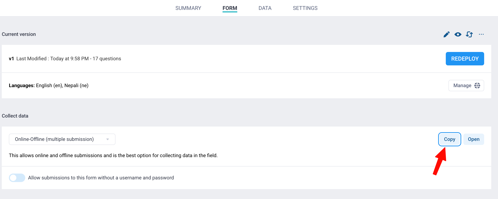

In this module you will upload your XLSForm to KoboToolbox, deploy it, test it, and share it with respondents.

## Upload and deploy your XLSForm

1. Before uploading, check your form in [XLSForm Online](https://getodk.org/xlsform/) and fix any errors it shows (see [Module 3](03-question-features.qmd#testing-and-versions)).

   {width=70% fig-align="center"}

2. Log in to the KoboToolbox Global server at <https://kf.kobotoolbox.org> with your username and password. If you don't have an account yet, create one first (see [Module 5](05-kobo-account.qmd)).

   {width=70% fig-align="center"}

3. Click **NEW** → **Upload an XLSForm** {height=2.5em .nolightbox style="vertical-align: middle;"}
4. Choose your `.xlsx` file and click **Upload**.

   ::: {layout-ncol=2}
   

   
   :::

5. Fill in the project details (name, description, sector: *Health Services / Public Health*, country: *Nepal*), then click **Create project**.

   {width=70% fig-align="center"}

6. Click the **eye icon** (Preview) to test the form in your browser. Check the skip logic, constraints and language switch.

   {width=70% fig-align="center"}

7. Click **Deploy**. This publishes your form so it can be used for data collection in the web form and in KoboCollect. Until a form is deployed, it cannot collect data, even if the upload worked.

   {width=70% fig-align="center"}

   After deployment, the project appears under **Deployed** in the left-hand sidebar, with the number of deployed forms shown next to it. Forms that are uploaded but not yet deployed appear under **Draft**.

   {width=40% fig-align="center"}

To upload a corrected version later, open the project's **Form** tab and choose **Replace form**.

## Collect test data

Test your form yourself before sharing it with anyone.

- **Web form:** in the **Form** tab, open the **Collect data** section, choose a web form option and click **Open**. Fill in the form in your browser.
- - **KoboCollect app (Android):** see [Module 7](07-kobocollect-mobile-app.qmd) for setup and use.
- Submit **3 to 5 test records**, including wrong values, to check your constraints.
- In the **Data** tab, check that your test records appear and that each column is correct. See [Module 9](09-download-data.qmd) for downloading the data.

::: {.callout-warning}
Delete all test submissions before you start real data collection.
:::

## Copying the link to share for self-administered surveys

In a **self-administered** survey, respondents fill in the form themselves on their own phone or computer, without a data collector. You only need to share a web link, and each answer goes straight to your KoboToolbox project.

1. Open your deployed project and go to the **Form** tab.
2. In the **Collect data** section, open the drop-down list and choose a web form option:
   - **Online-Only (single submission):** each person submits once and then sees a thank-you page. Best for most self-administered surveys.
   - **Online-Only (once per respondent):** also stops the same browser from submitting twice.
   - **Online-Offline (multiple submission):** for data collectors entering several interviews on one device.
3. Click **Copy** to copy the link.

   {width=70% fig-align="center"}

4. Share the link by email, WhatsApp, Viber or Messenger, or turn it into a QR code for posters and handouts.

**Benefits:** respondents don't need an app or a KoboToolbox account, the form works on any phone, tablet or computer, and you can reach many people quickly without printing or data entry.

::: {.callout-important}
## Allow submissions without login
If respondents are asked for a username and password when they open the link, go to your project's **Settings → Sharing** and turn on **Allow submissions to this form without a username and password**.
:::

::: {.callout-tip}
Start the form with a **consent question**, and test the link yourself on a phone before sharing it widely.
:::

## Common upload errors

If KoboToolbox or XLSForm Online shows an error, this table helps you find the cause quickly.

| Error message contains | Likely cause | Fix |
|:--|:--|:--|
| "list name not in choices sheet" | Typo between `select_one xyz` and `list_name` | Make both names identical |
| "unmatched begin statement" | Missing `end_group` | Add `end_group` |
| "duplicate name" | Two rows with the same `name` | Rename one |
| "invalid name" | Space or symbol in `name` | Use letters, numbers and `_` only |
| Error in `relevant` / `constraint` | Missing quotes, wrong `${name}` | Check spelling and quotes |

## Ethics and data protection

- Collect only what your approved protocol needs. Avoid names and phone numbers unless required.
- Share projects with your supervisor through **Settings → Sharing** rather than sharing your password.
- Download and store data on a password-protected device.
