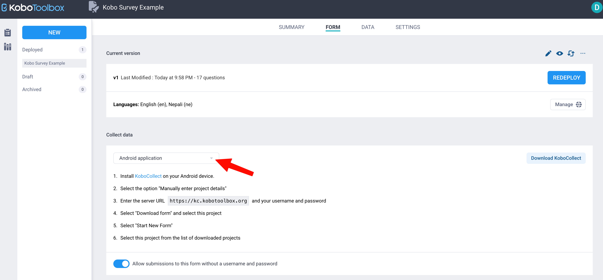
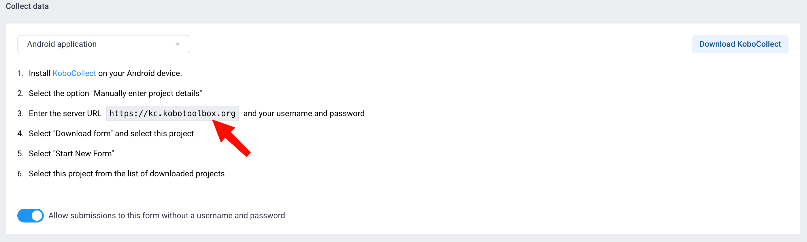
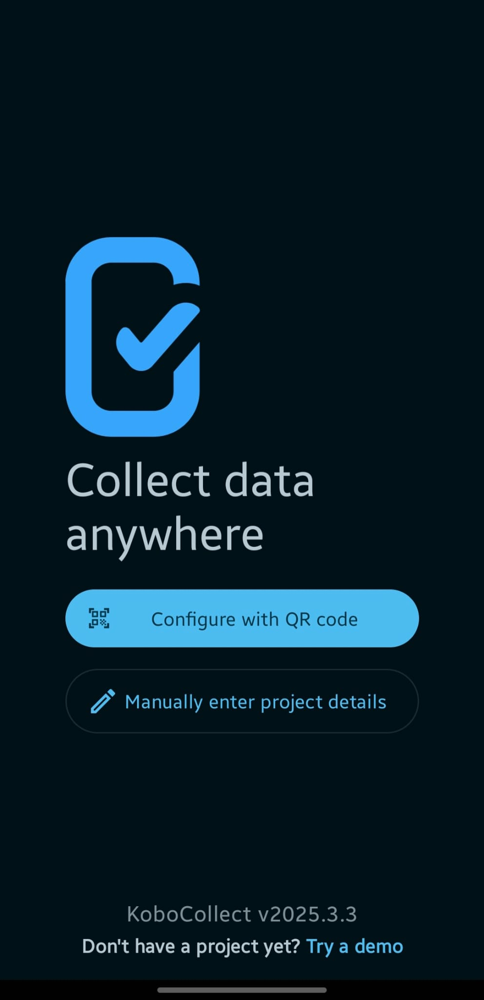
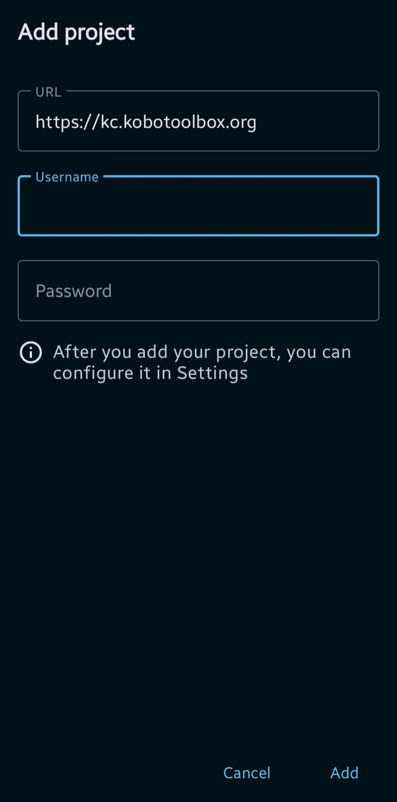
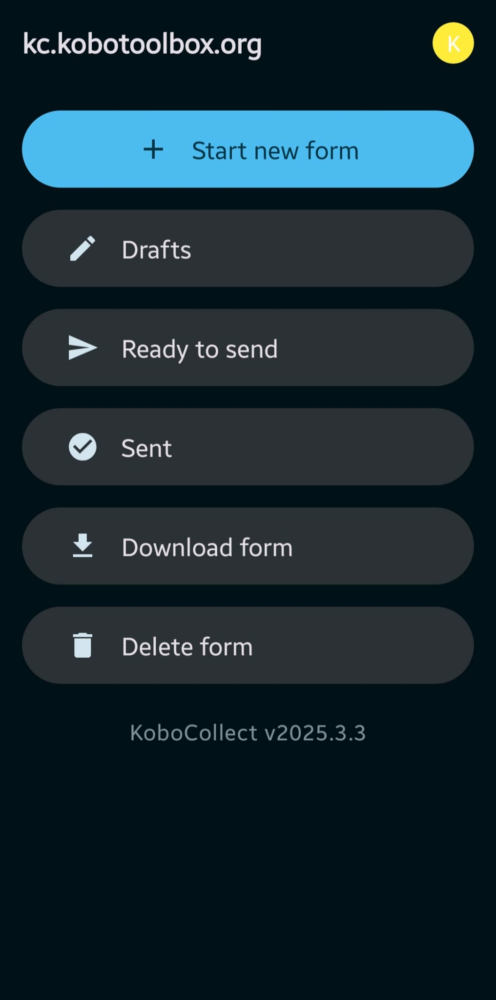
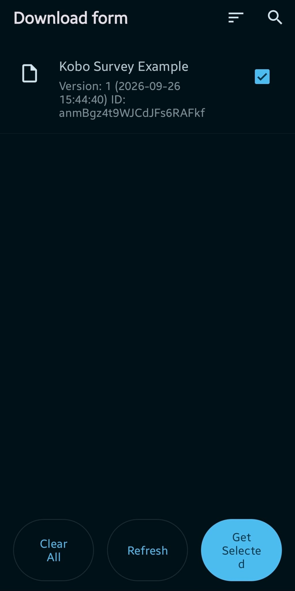
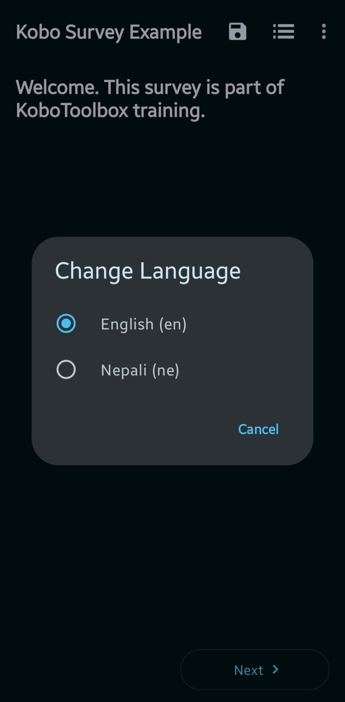

**KoboCollect** {height=1.5em .nolightbox style="vertical-align: middle;"} is a free Android app for collecting data with your KoboToolbox forms. Its biggest advantage is that it works **offline**: you can interview participants in places without internet, and send the data to the server later.

::: {.callout-note}
## Before you start
- An **Android** phone or tablet
- Your KoboToolbox **username** and **password** (Module 5)
- A **deployed** form in your KoboToolbox account (Module 6)
- Internet access for setup, downloading the form and sending data
:::

## Step 1: Install KoboCollect

1. Open the **Google Play Store** on your Android phone.
2. Search for **KoboCollect** and install the app published by *KoboToolbox*.
3. Open the app.

<!-- {width=40% fig-align="center"} -->

## Step 2: Connect the app to your KoboToolbox account

1. On your computer, log in to KoboToolbox and open your deployed project.
2. In the **Form** tab, open the **Collect data** drop-down list, scroll down to the end, and choose **Android application**.

   {width=70% fig-align="center"}

3. The instructions that appear show the **KoboCollect URL**. Note it down. For the Global server it is `https://kc.kobotoolbox.org`.

   {width=70% fig-align="center"}

4. On your phone, open KoboCollect and choose **Manually enter project details**.

   {width=40% fig-align="center"}

5. On the **Add project** screen, fill in the three fields:

   {width=40% fig-align="center"}

   - **URL:** enter `https://kc.kobotoolbox.org`. It may already be filled in. The address starts with **kc** (the data collection server), not **kf** (the website you log in to on your computer). KoboCollect only works with the **kc** address.
   - **Username:** your KoboToolbox username, the same one you use on the website. Type it in lowercase, without spaces.
   - **Password:** your KoboToolbox password.

   Then tap **Add**. The app connects to your account and the main menu appears.

::: {.callout-warning}
## Server address: kc, not kf
The server URL for KoboCollect starts with **kc**, not **kf**. Using `kf.kobotoolbox.org` (the website address) is the most common setup mistake.
:::

## Step 3: Download your form to the phone

1. In the main menu, tap **Download form**.

   {width=40% fig-align="center"}

2. Tick the form you deployed in KoboToolbox.

   {width=40% fig-align="center"}

3. Tap **Get selected** at the bottom right of the screen.

   {width=40% fig-align="center"}

If your form doesn't appear, check that it is **deployed** (not only uploaded) in KoboToolbox, and that you entered the correct username and server.

## Step 4: Fill in the form

1. Tap **Start new form** and choose your form.

   {width=40% fig-align="center"}

2. Answer each question, and swipe left or tap **Next** to move forward.
3. To switch between English and Nepali, tap the **⋮ menu** at the top right and choose **Change language**.

   {width=40% fig-align="center"}

4. At the end of the form, choose:
   - **Finalize**: the record is complete and ready to send.
   - **Save as draft**: you can open it later from **Drafts** and finish it.

<!-- {width=40% fig-align="center"} -->

::: {.callout-tip}
Filling in forms does **not** need internet. You can complete many interviews offline during the day and send them all at once.
:::

## Step 5: Send data to the server

1. When you have internet, tap **Ready to send** in the main menu.
2. Select the records you want to send, or tap **Select all**.
3. Tap **Send selected**.
4. Sent records move to **Sent**. Check that they appear in the **Data** tab of your project in KoboToolbox.

<!-- {width=40% fig-align="center"} -->

To send records automatically whenever the phone is online, turn on **Auto send** in the app settings (under *Form management*).

## Step 6: Update the form after changes

If you change your XLSForm and redeploy it in KoboToolbox, the phone still has the old version.

1. Send all finalized records first.
2. Tap **Download form** again and select the updated form.
3. Start new interviews with the new version.

## Working with more than one project

KoboCollect can connect to several KoboToolbox accounts and projects, even on different servers, and switch between them.

1. Tap the **Project icon** at the top right of the main menu.
2. Tap **Add project**, and set it up as in Step 2.
3. To switch projects, tap the Project icon and choose the project. The active project is listed first.

## Using an iPhone?

KoboCollect is only available for Android. On an iPhone, iPad or computer, use the **web form** instead:

1. In KoboToolbox, open your project's **Form** tab and find the **Collect data** section.
2. Choose the **online-offline** web form option and copy the link.
3. Open the link in the browser and add it to the **home screen**.

The online-offline web form can also be filled in without internet once it has been opened, and it sends the data when the connection returns.

## Good practice in the field

- **Test before the field:** fill in and send 3 to 5 test records, then check them in KoboToolbox. Delete the test records before real data collection.
- **Send data every day** when possible. Records on the phone can be lost if it is damaged, stolen or reset.
- **Never uninstall KoboCollect or clear its data** while records are still waiting in *Drafts* or *Ready to send*.
- **Protect the phone** with a screen lock, since it contains participants' data.
- Carry a **charger or power bank**; long field days drain the battery.

## Checklist

- [ ] KoboCollect installed on an Android phone
- [ ] App connected to my account with the `kc…` server URL
- [ ] My form downloaded to the phone
- [ ] At least one test record filled in, including a language switch
- [ ] Test record sent and visible in the KoboToolbox **Data** tab