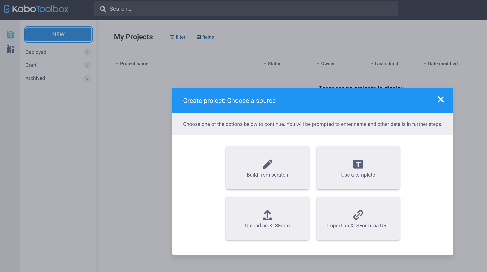

KoboToolbox also has a point-and-click **Formbuilder**. It is useful for small forms and quick edits. **XLSForm** is better for long, bilingual research questionnaires, but it helps to know both.

| | **Formbuilder** | **XLSForm** |
|---|---|---|
| **Pros** | Quick to use, no syntax needed; good for small forms and fast edits | Handles bilingual labels well; scales to long, complex forms; easy to save, version, and reuse |
| **Cons** | Harder to manage for long or bilingual forms; no file to save or version | Steeper learning curve; slower for small, one-off changes |

## Build a form from scratch

1. **NEW** → **Build from scratch** → enter project details → **Create project**.

2. Enter your project details: **Project name**, and optionally a **Description** and **Sector**. Then click **Create project**.

3. Click **+** to add a question, type the question text, and choose the type (Select One, Select Many, Text, Number, Decimal, Date, Time, Note, Rating …).
4. For choice questions, type each option. Click **+** to add more options.
5. Click the **gear icon** (Settings) on a question to set:
   - **Mandatory response** (required)
   - **Skip logic** (relevant): choose the earlier question and condition
   - **Validation criteria** (constraint) and the error message
   - **Appearance** and **hint**
6. Select several questions and click **Group** to create a section.
7. Use **Manage translations** to add Nepali labels.
8. **Save**, **Preview**, then **Deploy**.

## Formbuilder and XLSForm together

- Download any Formbuilder project as XLS (**Form tab → ⋯ → Download XLS**). This is a good way to learn XLSForm syntax: build a question in the Formbuilder, download, and see how it is written.
- You can upload an XLSForm and then make small edits in the Formbuilder.

::: {.callout-note}
## Practice
Rebuild the Section C Likert scale from the example file in the Formbuilder using the **Rating** question type, then download it as XLS and compare it with the XLSForm version.
:::
